# Amazon AI 导购深度调研

> 调研日期：2026-05-13｜对应计划：pre-dev-research-plan S1.3（行业 D3）
> 核心问题：Amazon Rufus 的产品设计、技术路线和商业效果是什么？2025-2026 年战略演进方向是什么？

---

## 一、战略定位：从「AI 搜索增强」到「AI 贯穿全链路」

Amazon 的 AI 购物战略经历了清晰的两阶段演变。Rufus 上线初期（2024 年）的核心命题是「比传统搜索更好的商品发现」；2025 年起转向「AI 作为购物全程的主动代理」——从被动响应用户查询，变成主动执行购买任务。这不仅是功能迭代，而是产品定位的根本转变。

这个转变背后是 Amazon 对 AI 基础设施的大规模押注：2026 年资本支出计划超过 2000 亿美元，AI 和 AWS 是重心。CEO Andy Jassy 多次公开表示 AI 将重塑 Amazon 每一条业务线，电商购物是最高优先级应用方向。当前战略的三个关键词是：**普及**（Rufus 覆盖 3 亿以上用户，查询量达千亿级）、**深化**（从对话导购延伸到 Agentic 自动购买）、**生态**（将购物 AI 能力开放给第三方，通过 Bedrock AgentCore 形成平台）。

---

## 二、产品演进时间线

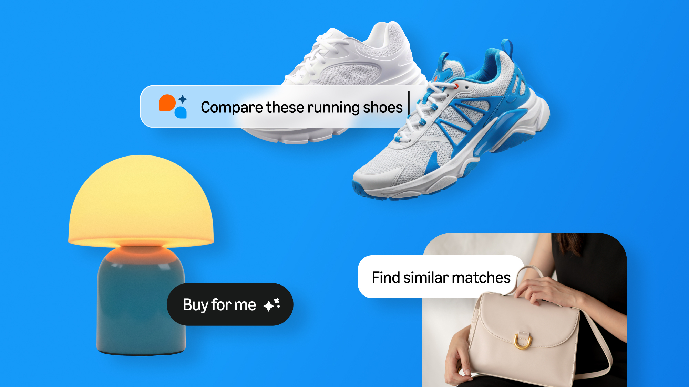
*来源：About Amazon（2026.01）*

```
2024.02  ──  美国小范围内测，基础问答 + 商品推荐
2024.H2  ──  全量上线美国，扩展到英国、印度等多个海外市场
2024.Q4  ──  日均查询量达 2.743 亿次（占 Amazon 总搜索 13.7%）
2025.Q1  ──  推出价格追踪 + 30/90 天历史价格查询
2025.11  ──  上线 Agentic 功能（Auto-Buy + Buy for Me 跨站代购）
2025.全年 ── 处理查询超千亿次，带来 $120 亿销售增量；月活增长 149%
2026.Q2  ──  发布 Bedrock AgentCore；测试将 Rufus 对话合并进主搜索栏
```

Rufus 是 Amazon 有史以来最快达到亿级用户的产品之一。从内测到全球 3 亿以上用户，不到两年时间。2026 年的入口合并测试是关键信号：AI 导购正在从「独立功能」向「搜索基础设施」升级，和传统搜索框的边界正在消失。

---

## 三、用户端功能

### 对话式商品搜索

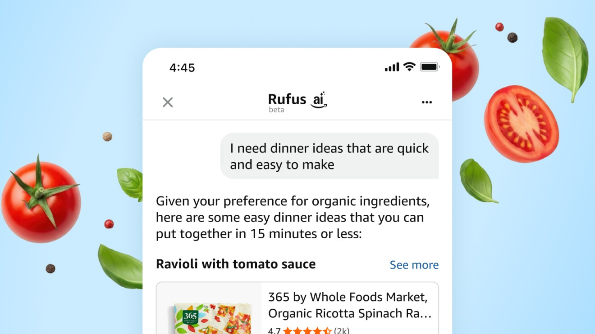
*来源：About Amazon*

Rufus 的核心是将自然语言描述转化为精准的商品推荐。典型场景：用户说「我需要给我 8 岁爱运动的儿子买生日礼物，预算 50 美元」，Rufus 会同时解析年龄、兴趣、预算三个槽位，返回分类推荐（运动装备/球类/运动游戏）、具体商品和推荐理由，而不是一个关键词命中的商品列表。支持多轮对话上下文，用户可以追问「有没有户外的」「换一个价格低一点的」，Rufus 会在已有上下文中做增量推理。

与传统搜索的根本差异在于：传统搜索是用户做决策前的「资料收集工具」，Rufus 是「初步决策工具」——它不只展示选项，而是帮用户做了第一轮筛选并给出推荐理由。

### Help Me Decide

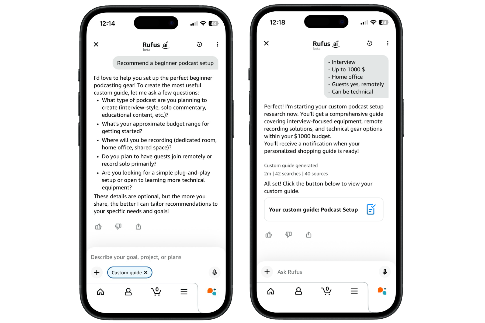
*来源：Amalytix Rufus Guide 2026*

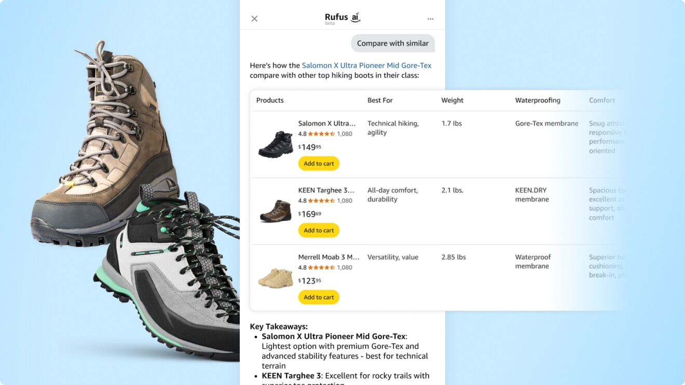
*来源：About Amazon（2026.01）*

针对用户面对过多选项时的决策困难，Rufus 提供主动的差异归纳。AI 会自动识别候选商品之间的关键差异点，用通俗语言解释技术规格（比如「这款电池能用一整天」而不是「5000mAh」），根据用户已透露的需求将选项收窄到 2-3 个，并说明各自适合哪类用户。这个功能在高参数复杂度品类（电子产品、家用电器）中表现最突出，是 Rufus 相比竞品差异化最明显的地方之一。

### 个性化记忆系统

Rufus 会在对话中主动学习用户信息：家庭成员构成（子女年龄、宠物品种）、饮食限制、历史购买偏好的价格区间。这些信息在后续对话中被复用，无需用户重复描述背景。更进一步的能力是跨服务记忆——读取 Kindle 阅读历史、Prime Video 观看记录、Audible 收听记录，形成跨消费场景的用户画像。例如用户刚在 Kindle 上读完一本烹饪书，Rufus 可以主动推荐相关厨具。这个能力的壁垒在于 Amazon 拥有从阅读到购物的完整生态数据，其他玩家难以复制。

### 视觉输入

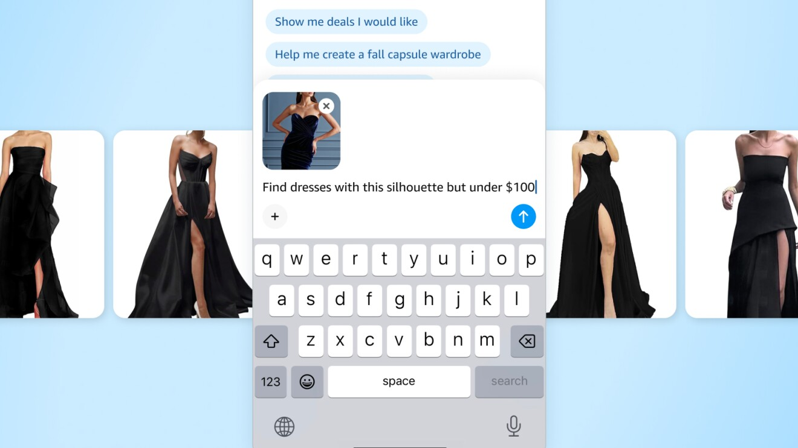
*来源：About Amazon*

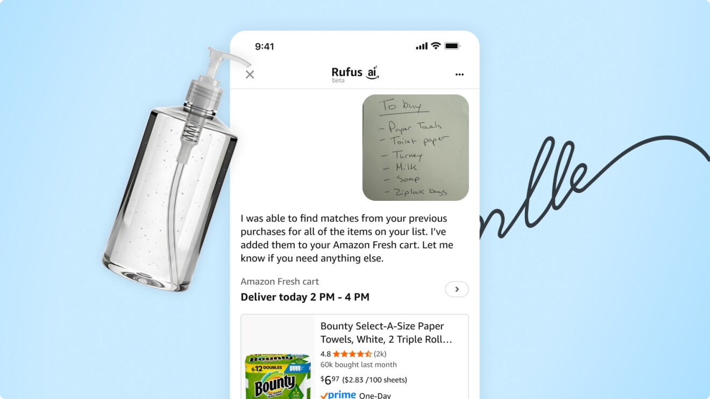
*来源：About Amazon（2026.01）*

Rufus 支持三种视觉输入方式：拍照识别手写购物清单、图片搜索（上传图片找相似商品）、实物拍照识别（拍真实物品找同款或替代品）。图片搜索和实物识别已覆盖 iOS 和 Android，手写清单识别目前仅限 iOS。视觉输入的实际使用率没有公开数据，但从产品逻辑看，它主要服务「我不知道这东西叫什么」的场景，是文字搜索的补充而非替代。

### 价格追踪与信任建设

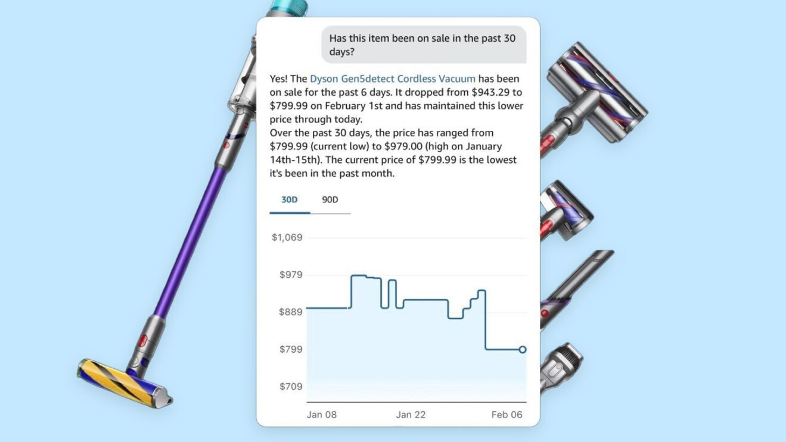
*来源：About Amazon（2026.02）*

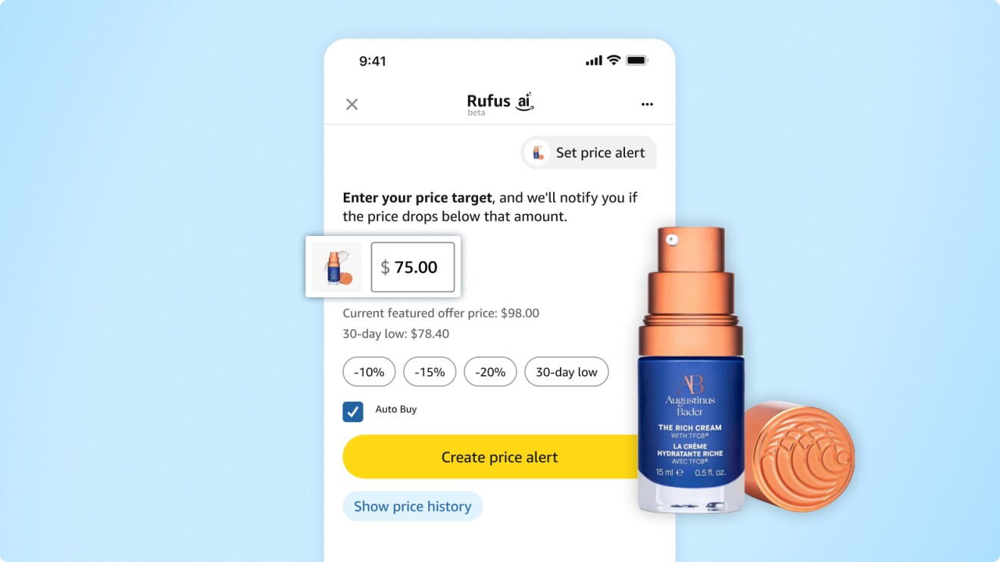
*来源：About Amazon（2026.01）*

2025 年 Q1 上线的 30 天/90 天历史价格查询，是 Rufus 在信任建设上的一步重要举措。用户可以在对话中直接问「这个商品现在的价格是不是历史低价」，Rufus 结合价格曲线给出判断，还支持设置目标价提醒。历史价格透明化的产品逻辑很清晰：AI 导购的最大障碍不是「用户不会用」，而是「用户不确定 AI 有没有在偏向某些商品」。主动展示历史价格是低成本但高信任价值的设计。

---

## 四、Agentic 购物：从「推荐」到「代劳」

### Auto-Buy 自动购买

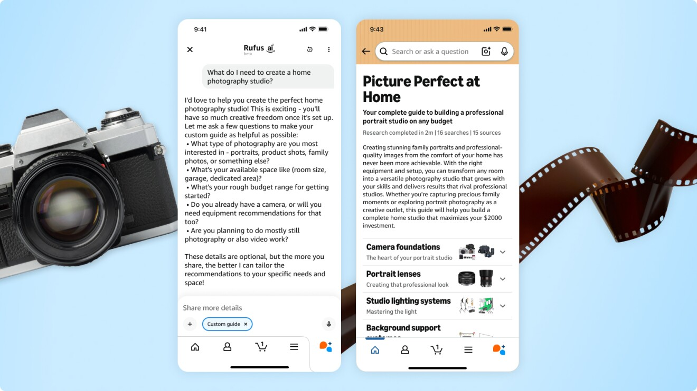
*来源：About Amazon（2026.01）*

2025 年 11 月上线的 Auto-Buy 功能让 AI 在用户授权后自动完成购买流程。用户设定条件（「价格低于 X 元时购买」、「库存剩余 Y 件时自动补货」），Rufus 在条件满足时触发交易并发通知确认。对于日用品、耗材、固定品牌偏好的食品，Auto-Buy 几乎消除了购物摩擦；对于电子产品、服装等高决策成本品类，它更多承担「到价提醒 + 一键确认」的辅助角色。功能目前已覆盖数十万 SKU，失败率和用户接受度没有官方详细披露。

### Buy for Me：跨站购物代理

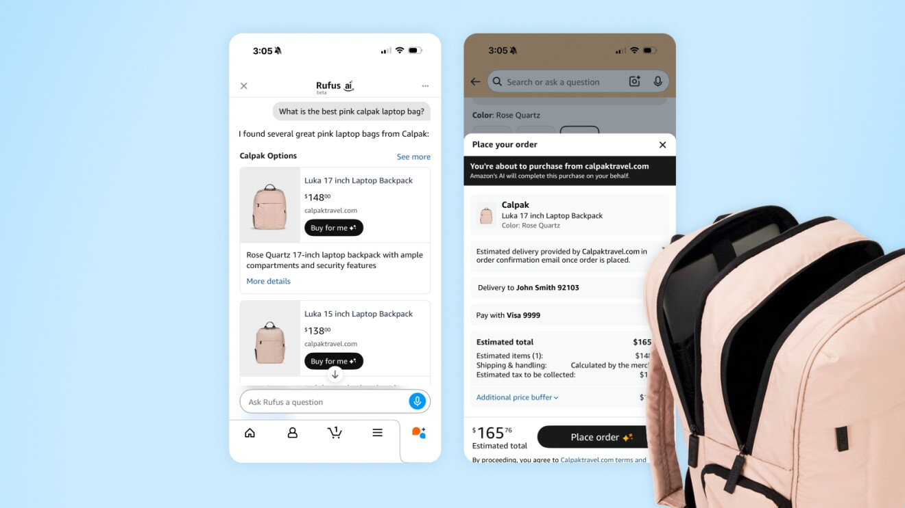
*来源：About Amazon（2026.01）*

Buy for Me 是目前最激进的 Agentic 购物实践——它允许用户通过 Amazon 购买不在 Amazon 上销售的商品。Rufus 作为用户的购物代理，在 Amazon 商品库找不到满意结果时，可以授权 AI 去第三方品牌官网完成查找、加购、支付的全流程，商品直接配送给用户。截至调研时支持商品超过 50 万件，覆盖服装、美妆、家居等类目，均来自第三方合作品牌。

Buy for Me 的商业逻辑是双面的：短期内扩大 Amazon 的实际商品覆盖范围、提升平台黏性；但长期看，如果用户习惯绕过第三方平台直接通过 Amazon 代购，抽佣比例和数据归属会引发复杂的生态博弈。功能仍处于测试阶段，规模有限。

---

## 五、UX 交互设计

### 入口设计

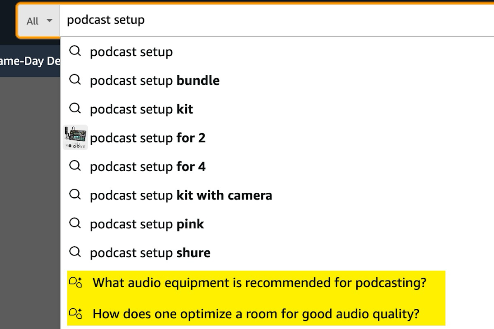
*来源：Amalytix Rufus Guide 2026*

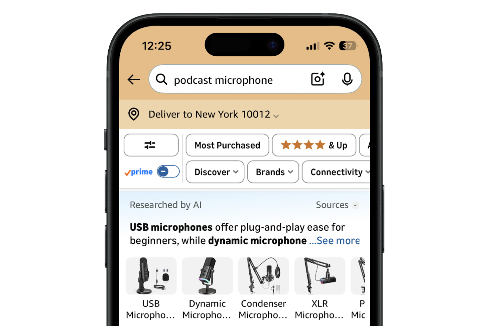
*来源：Amalytix Rufus Guide 2026*

Rufus 有三种入口，对应不同的使用场景：搜索栏下方直接显示 Rufus 对话提示（主动引导，低感知成本）；商品详情页内嵌「问 Rufus」按钮（在决策关键节点介入）；底部抽屉式弹出的独立对话界面（深度对话场景）。2026 年的桌面端测试新增了一种形式：在传统搜索结果上方叠加「Researched by AI」模块，用户可以选择「看 AI 总结」或「直接看商品列表」，不强制进入 Rufus 界面。

这个设计策略的核心原则是：**AI 导购出现在用户已有流程的正确节点，而不是要求用户去找它**。Rufus 从没有做独立 App，从第一天就是搜索流程的延伸。

### 对话交互细节

Rufus 回复中的关键词和产品类别会高亮显示（Noun Phrase 交互），用户点击高亮词可以快速细化追问，减少打字成本。回复采用流式输出，边生成边展示，不等全部完成——这对长回复（如 Help Me Decide 的差异对比）的体验影响尤为明显。每条回复下方有 👍/👎 按钮，反馈直接进入强化学习训练循环，是系统持续改进的数据来源。

---

## 六、技术架构

Rufus 的整体技术路线是「自研购物专用 LLM + RAG 实时检索」的组合，不依赖通用大模型直接上线。底层是用 Amazon 完整商品目录、用户评价和社区 Q&A 微调的专用语言模型，上层用 RAG 在每次查询时实时检索最新商品数据，确保价格和库存信息的时效性。回复生成层使用 Claude Sonnet 和 Amazon Nova 组合，最终输出通过 Markup 渲染层转化为 UI 组件。

在推理优化上，Rufus 使用了两项关键技术：「多解码头并行」（在基础模型上叠加多个小神经网络层，并行预测 Token 加速生成）和「连续批处理」（每生成一个 Token 后重新路由新请求，相比传统批处理推理速度提升 2 倍）。Prime Day 期间用于支撑 Rufus 的 AWS Inferentia + Trainium 推理芯片达到 8 万块，是目前公开的消费级 AI 产品中基础设施规模最大的案例之一。用户的 👍/👎 反馈通过 RLHF 直接进训练循环，Rufus 在真实用户对话中持续迭代。

2026 年 4 月发布的 Bedrock AgentCore 是 Amazon 把 Rufus 底层能力对外开放的关键举措：将多步骤任务执行、工具调用、记忆管理、权限控制打包成 API，开放给第三方零售商接入，并集成了 Coinbase 和 Stripe 支付模块，支持 AI Agent 直接发起支付授权。Amazon Personalize（托管推荐服务）也在 2025 年完成升级，支持将会话级实时行为融入推荐决策，以 AWS 服务形式对外输出了 Amazon 二十年积累的推荐系统能力。

---

## 七、商业效果

| 指标 | 数据 | 来源 |
|------|------|------|
| 2025 年年度查询量 | 超千亿次 | Businesswire |
| 2024 Q4 日均查询占比 | Amazon 总搜索的 13.7% | Amazon |
| 月活用户增长（2025 vs 2024） | +149% | PYMNTS |
| 互动次数增长 | +210% YoY | PYMNTS |
| 覆盖用户数 | 3 亿以上 | Amazon |
| 2025 年销售增量 | 约 $120 亿 | Fortune / Amazon Q3 财报 |
| 使用 Rufus 用户转化率提升 | +60% | Amazon |
| Buy for Me 节省费用 | 用户平均每次节省 20% | Amazon |
| 预计利润（2027 年） | $12 亿（内部预测） | 分析师报告 |

$120 亿销售增量是「可追溯到 Rufus 交互」的增量销售，存在归因窗口（7 天内购买算 Rufus 拉动）的统计口径问题，实际影响可能更大但难以完整归因。

---

## 八、产品局限与批评

Rufus 并非没有争议。最主要的问题是**广告混入推荐**：部分 Rufus 「推荐」商品实为付费广告，用户难以分辨，这直接削弱了「AI 客观推荐」的信任基础。其次，多条件、跨品类的复杂需求处理效果仍不稳定，与 ChatGPT Deep Research 类的深度调研能力相比，Rufus 在信息深度上存在明显差距。地区差异也较大，美国以外市场的功能覆盖不完整。入口方面，2026 年之前用户对「什么时候用 Rufus、什么时候用搜索框」的边界感模糊，这也是推动入口合并的原因之一。

---

## 九、对我们的核心启示

从货架电商的视角，Amazon 是三家竞品中与我们场景最接近的对标——用户带着需求来，理性比较是决策主路径。Rufus 的规模数据（13.7% 搜索占比、千亿查询量、+60% 转化率）证明了 AI 导购在货架场景的真实需求，也验证了产品设计可以解决用户接受度问题。

对我们直接借鉴价值最高的几点：**入口不必独立**，嵌入原有搜索流程远比独立 App 的获客成本低；**价格透明化是低成本高价值的信任手段**，简单功能但对转化信任影响显著；**Agentic 功能从低风险品类起步**，Amazon 也是先从日用品切入 Auto-Buy；**渐进式入口合并**是正确节奏，Rufus 先运行两年验证价值，再做入口合并。

我们与 Amazon 最大的差距不在功能设计，而在数据积累——Rufus 可以调用用户全历史购买记录、评价行为、愿望清单甚至跨服务阅读历史来做个性化，我们冷启动阶段缺乏这些信号。这意味着早期产品需要更多依赖垂直品类约束来弥补个性化数据不足，而不是追求横向通用覆盖。

Rufus 的广告混推问题对我们反而是机会：如果能做到「推荐结果无广告混入」并明确告知用户，是与现有所有 AI 导购产品差异化的直接切入点。

---

## 参考资料

1. Amazon Science《How Rufus uses generative AI to answer shopping questions》
2. Amazon About《Amazon launches Rufus, a new generative AI-powered conversational shopping assistant》（2024）
3. AWS Blog《Scaling Rufus with 80,000 AWS Inferentia and Trainium chips for Prime Day》
4. About Amazon《Rufus latest personalized shopping features》
5. Businesswire《Amazon's Rufus generated over 100 billion queries in 2025》
6. Bloomberg《Amazon Tests Merging Rufus AI Into Main Search Bar》（2026）
7. Fortune《Amazon Rufus AI Shopping Assistant: $10 Billion in Sales》（2025.11）
8. PYMNTS《Amazon AI Assistant Rufus Sees 149% Jump in Users》（2025）
9. CNBC《Amazon rolls out AI shopping agent that can buy products from other websites》（2025.11）
10. TechCrunch《Amazon's Buy for Me lets its AI shop at other retailers on your behalf》（2025）
11. AWS Blog《Introducing Amazon Bedrock AgentCore》（2026-04）
12. Reuters《Amazon plans $200 billion in capex for 2026》
13. The Verge《Amazon Rufus gets price history and other shopping tools》（2025-Q1）
14. Novadata《Amazon Rufus Agentic Auto-Buy Features》
